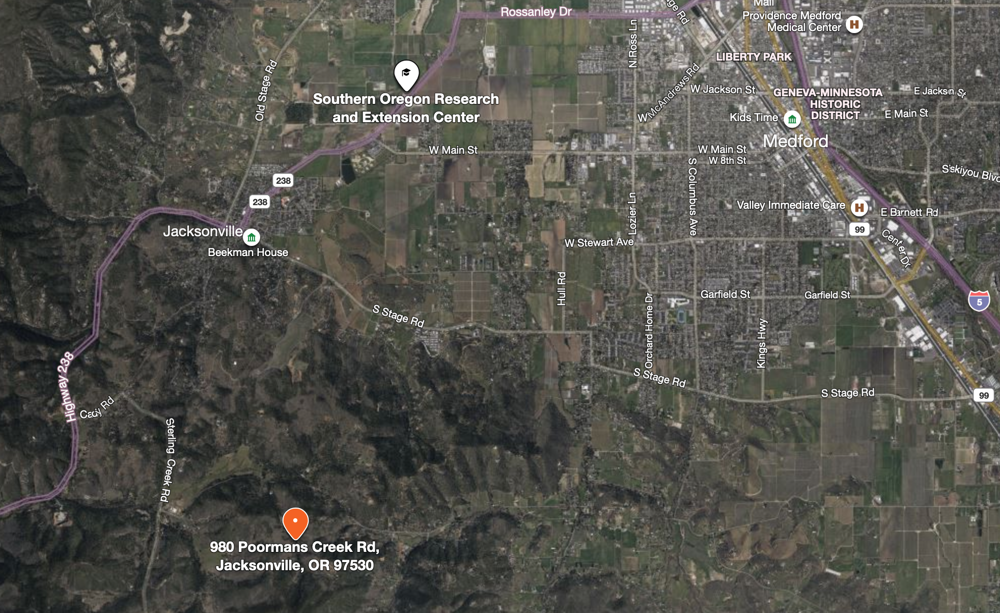
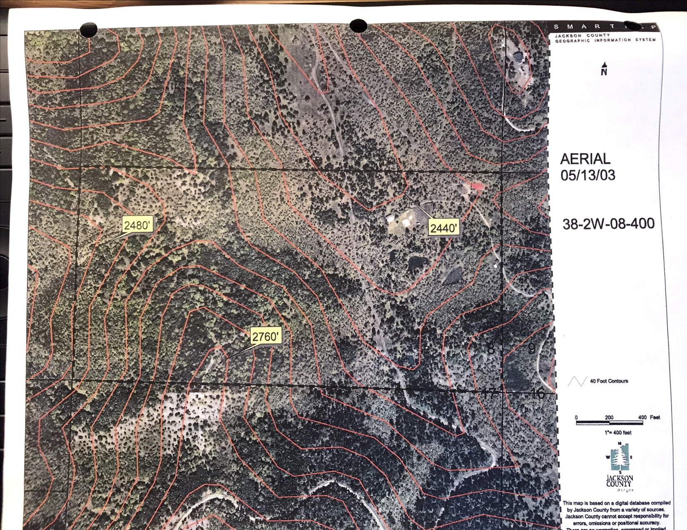
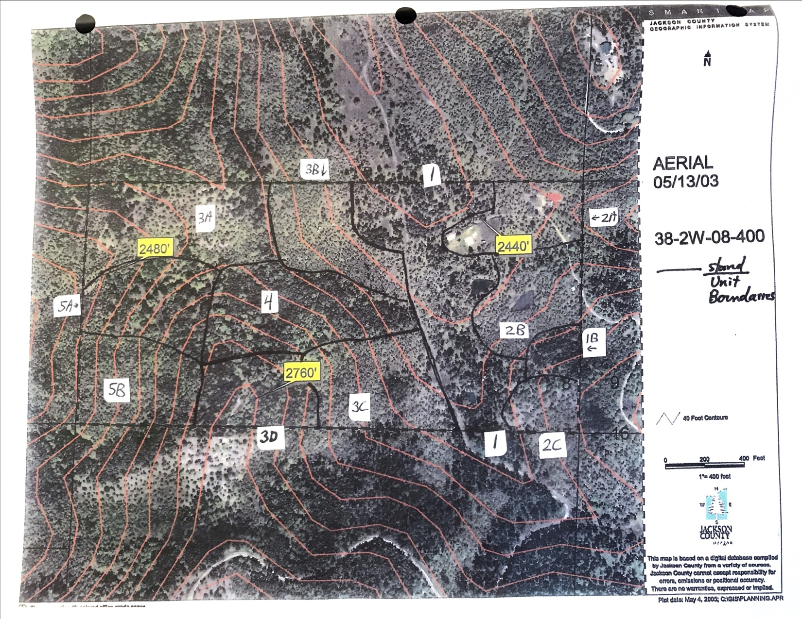
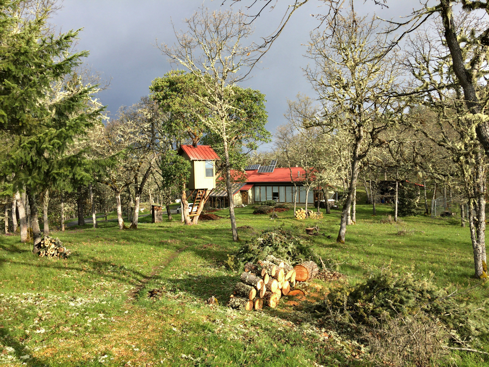
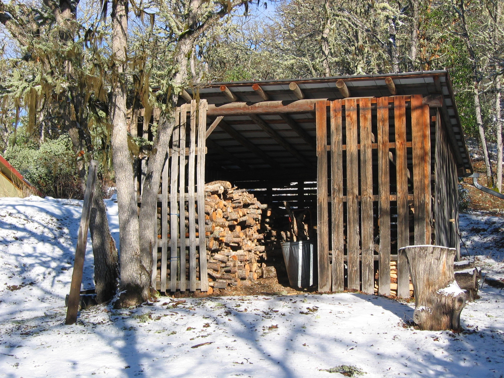
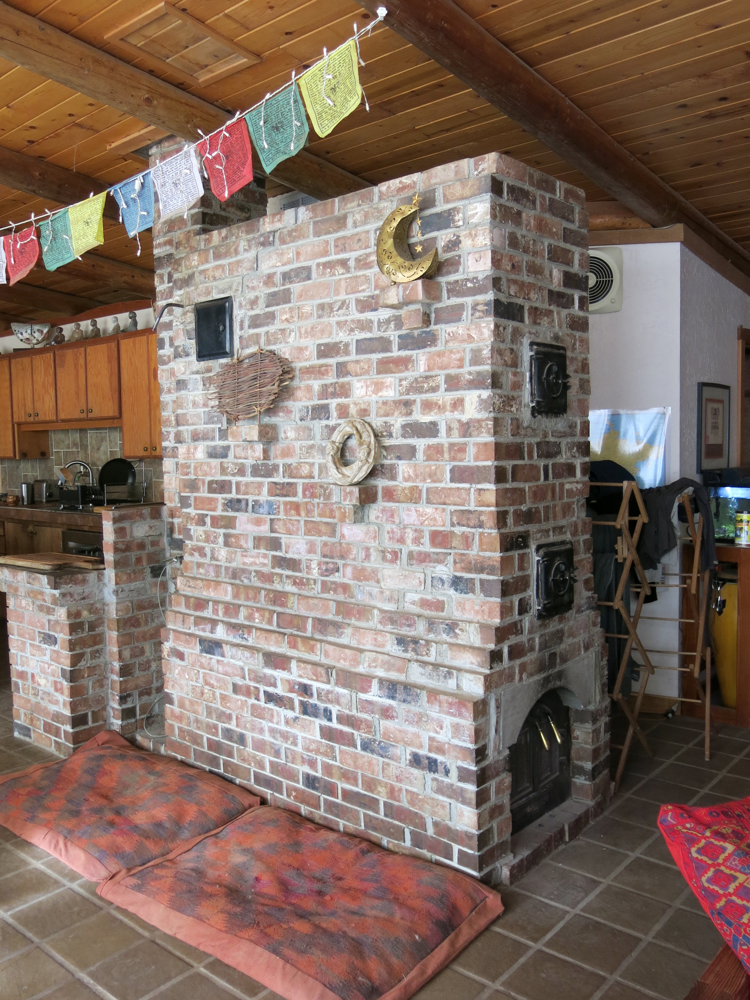

<!--
author:   Monty Zukowski

email:    monty@washdish.com

version:  0.0.1

language: en

narrator: US English Female

comment:  Land steward presentation.

link:     https://cdn.jsdelivr.net/chartist.js/latest/chartist.min.css

script:   https://cdn.jsdelivr.net/chartist.js/latest/chartist.min.js

-->

# Woodland Sun Land Steward Presentation

## Property Overview

[Google Earth link](https://earth.google.com/web/search/980+Poormans+Creek+Road,+Jacksonville,+OR/@42.27458405,-122.95706143,761.37107052a,707.43693216d,35y,0h,0t,0r/data=CigiJgokCb3hg015yDdAEbnhg015yDfAGd4P3Tbzs0NAIS29zFVDxlDA)

## Vegetation

Mostly oak savannah with some stands of Madrone, Ponderosa Pine and Dog Fir. Also some areas that are primarily manzanita and buck brush. 

## Wildlife
!?[Bobcat](pics/Bobcat-cvTIhK4UJuQ.mp4)<!-- autoplay="true" muted="true" -->
!?[Bears](pics/107.mp4)<!-- autoplay="true" muted="true" -->

One of our primary goals moving here is to preserve and enhance wildlife habitat. Part of my learnings here is to remove fences and to sow pollinator plants. We have black bear, bobcat, deer, great gray owls, rough skinned newts and much more. 

## Solar house wood heat

Our house is earth bermed and 