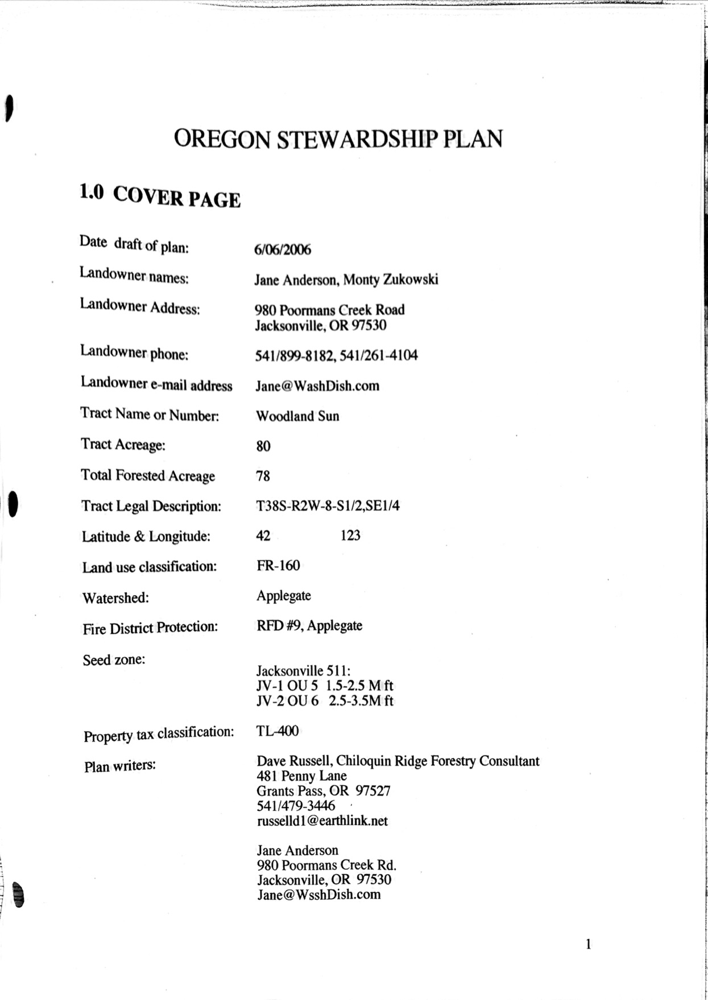
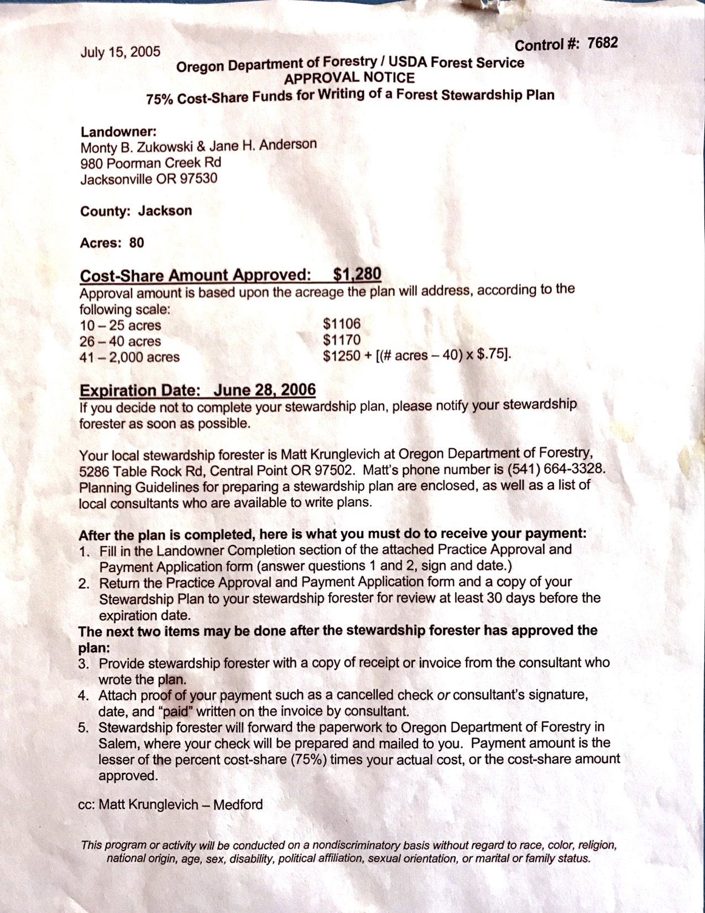
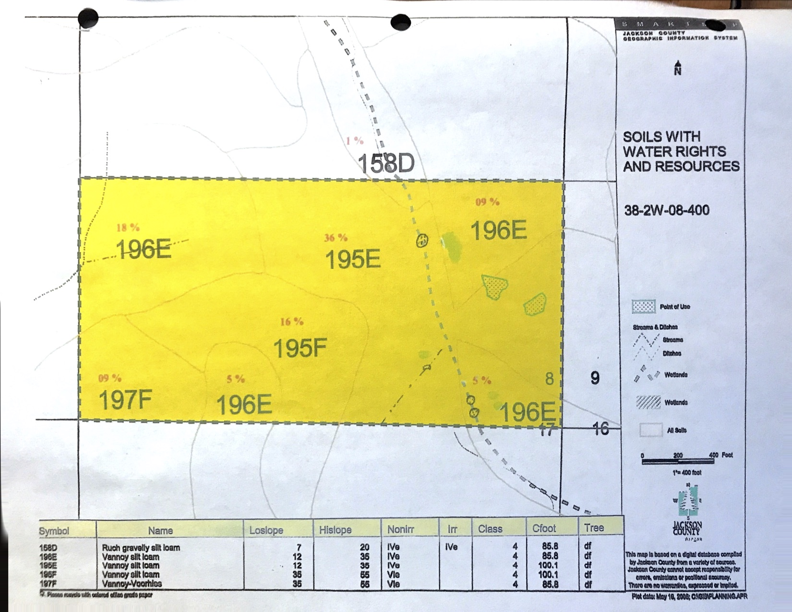
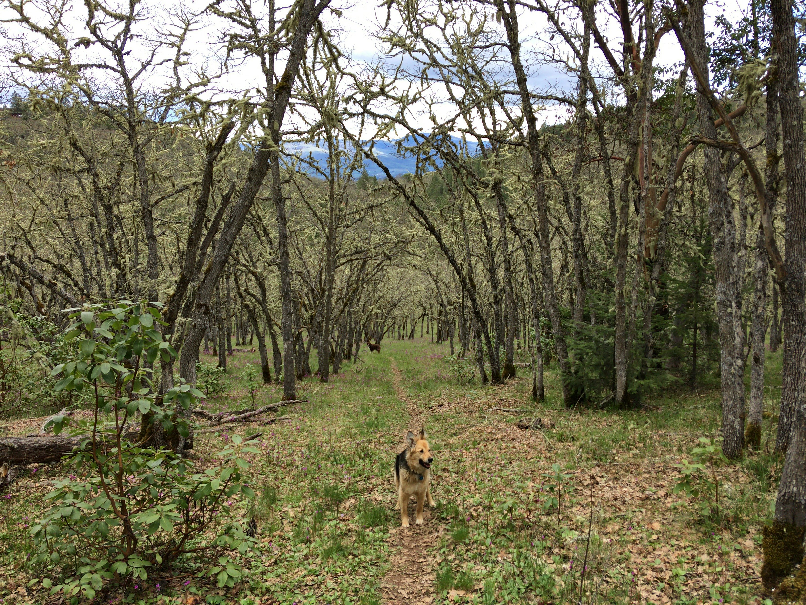
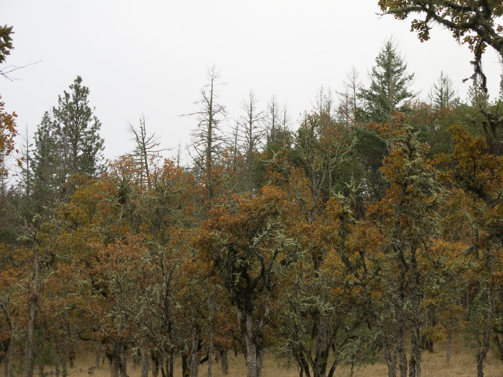
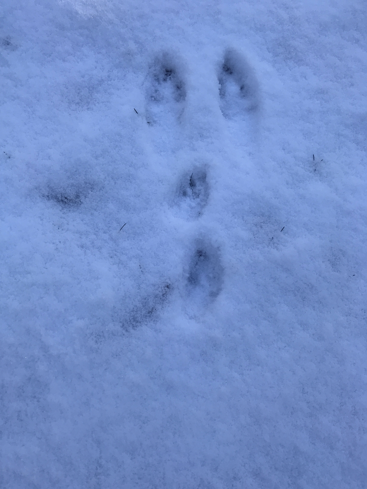
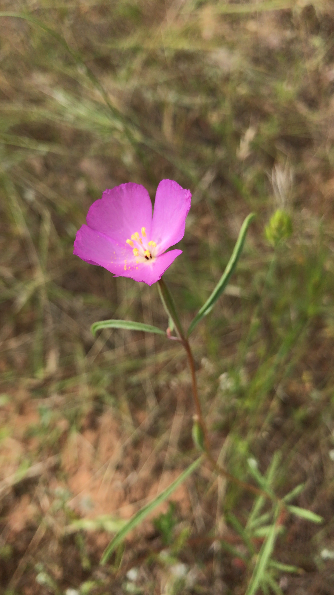
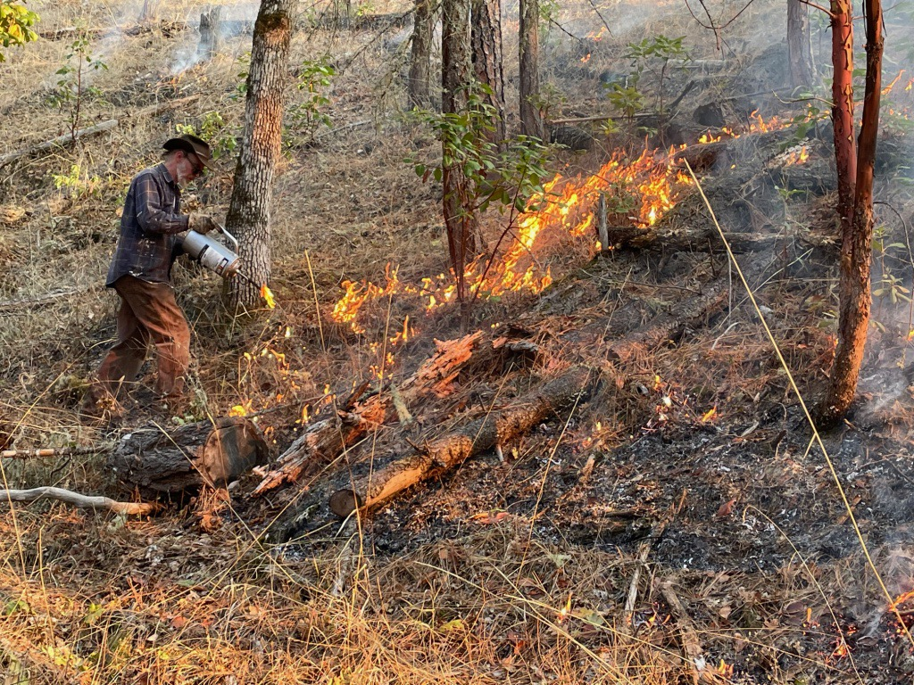

<!--
author:   Monty Zukowski

email:    monty@washdish.com

version:  0.0.1

language: en

narrator: US English Female

comment:  Land steward presentation.

link:     https://cdn.jsdelivr.net/chartist.js/latest/chartist.min.css
link:     css/my.css

script:   https://cdn.jsdelivr.net/chartist.js/latest/chartist.min.js

import: https://raw.githubusercontent.com/LiaTemplates/Fullscreen/0.0.1/README.md
-->

# Woodland Sun Land Steward Presentation
Monty Zukowski & Jane Anderson

## Property Overview

[Google Earth link](https://earth.google.com/web/search/980+Poormans+Creek+Road,+Jacksonville,+OR/@42.27458405,-122.95706143,761.37107052a,707.43693216d,35y,0h,0t,0r/data=CigiJgokCb3hg015yDdAEbnhg015yDfAGd4P3Tbzs0NAIS29zFVDxlDA)

## Stewardship plan
In 2005 we got an ODF grant to write a Stewardship Plan. My wife Jane Anderson co-authored it. So lucky me, I already had that homework done!

 

## Soil types

## Vegetation

Mostly oak savannah with some stands of Madrone, Ponderosa Pine and Dog Fir. Also some areas that are primarily manzanita and buck brush. 

## Trees

## Wildlife
!?[Deer](pics/Deer.mp4)<!-- autoplay="true" muted="true" -->
!?[Bears](pics/107.mp4)<!-- autoplay="true" muted="true" -->
!?[Doves](pics/Doves.mp4)<!-- autoplay="true" muted="true" -->

One of our primary goals moving here is to preserve and enhance wildlife habitat. Part of my learnings here is to remove fences and to sow pollinator plants. We have black bear, bobcat, deer, great gray owls, rough skinned newts and much more. 

## Solar house

Our house is earth bermed and heated with wood and sunshine. We have a rain catchment system that gravity feeds our plumbing. We pump water up to it with our well.

## Goal
To live sustainably in a healthy forest that supports a diverse web of life and works with fire.

## Projects
* Remove fencing
* Build a wood fired kiln
* Keep thinning (We've got funding to thin all 80 acres in Lomakatsi's West Bear Project)
* Sow pollinator seeds
* Sculpture path
* Add roads and trails to facilitate prescribed burning
* Build soil in our garden

